# Hi, I'm Viko Andri Bastian Manurung

**Fullstack & DevSecOps Engineer** — Jakarta, Indonesia.

I work on banking systems and the security review they have to pass before
release. Two of the projects below, sprig and finwatch, came out of that work.

---

## 📦 Featured work

**[sprig](https://github.com/vianbas/sprig)** · Java · MIT — Static security linter for Spring Boot. Analyzes both source and configuration without compiling or running the project: wildcard CORS with credentials, `{noop}` plaintext passwords, `.anyRequest().permitAll()`, exposed actuator endpoints, hardcoded secrets. Ten rules, each with a documented false-positive rationale.

**[finwatch](https://github.com/vianbas/finwatch)** · Go · Apache-2.0 — A modular monolith showing how to structure near-real-time transaction monitoring and operational alert workflows, on entirely synthetic data. An educational reference, not a fraud or compliance product.

**[indonesia-kpr-calculator](https://github.com/vianbas/indonesia-kpr-calculator)** · TypeScript — Indonesian mortgage simulator: annuity, flat, and tiered-floating schedules, plus KPR Syariah (murabahah, musyarakah mutanaqishah). Also covers the upfront costs: provision, appraisal, notary, BPHTB, insurance. Runs entirely in the browser. [kpr.vikoabastian.com](https://kpr.vikoabastian.com)

---

## 📊 GitHub

<!-- facts:start -->

<!-- facts:end -->

<picture>
  <source media="(prefers-color-scheme: dark)" srcset="assets/contrib-dark.svg">
  
</picture>

---

## 🛠️ Tech Stack

**Backend** &nbsp;     

**Frontend** &nbsp;    

**DevSecOps & Data** &nbsp;     

---

## 👤 About me

- 🏦 **Banking domain** — Telegraphic Transfer & RTGS, ATM/CRM monitoring
  (E-Channel Go), SKN clearing & tax collection, dispute management.
- 🛒 **Freelance e-commerce** — ArtSwara: catalog, cart, Midtrans payments,
  courier integration, voucher & ticketing, offline POS. Also
  [W-Commerce](https://w-commerce.vikoabastian.com), a mobile-first storefront
  for small sellers with Midtrans Snap and WhatsApp checkout.
- 🔐 **DevSecOps** — CI/CD (Jenkins, GitHub Actions), private-cloud deployment,
  penetration-test remediation.
