# Hi, I'm Viko Andri Bastian Manurung 👋

**Fullstack & DevSecOps Engineer** — Jakarta, Indonesia.

I build and ship software across the stack: Laravel & Spring Boot backends,
React & Next.js frontends, with a strong DevOps focus — CI/CD, cloud
infrastructure, and security. Years in banking (TT/RTGS, ATM/CRM monitoring,
clearing, dispute management, payment gateways) plus freelance e-commerce builds.

---

## 📊 GitHub

<picture>
  <source media="(prefers-color-scheme: dark)" srcset="assets/stats-dark.svg">
  
</picture>
<picture>
  <source media="(prefers-color-scheme: dark)" srcset="assets/top-langs-dark.svg">
  
</picture>

| GitHub facts | |
|---|---|
| 💻 Public repositories | 43 |
| 👥 Followers | 7 |
| 🚀 PRs merged into external repos | 6 |
| 📅 GitHub member since | 2015 |

---

## 🛠️ Tech Stack

---

## 👤 About me

- 🏦 **Banking domain** — Telegraphic Transfer & RTGS, ATM/CRM monitoring
  (E-Channel Go), SKN clearing & tax collection, dispute management.
- 🛒 **Freelance e-commerce** — ArtSwara: catalog, cart, Midtrans payments,
  courier integration, voucher & ticketing, offline POS.
- 🚀 **Side projects** — [KPR Calculator](https://kpr.vikoabastian.com),
  [W-Commerce](https://w-commerce.vikoabastian.com), this portfolio.
- 🔐 **DevSecOps** — CI/CD (Jenkins, GitHub Actions), private-cloud deployment,
  penetration-test remediation.

---

*Thanks for visiting — feel free to reach out!*